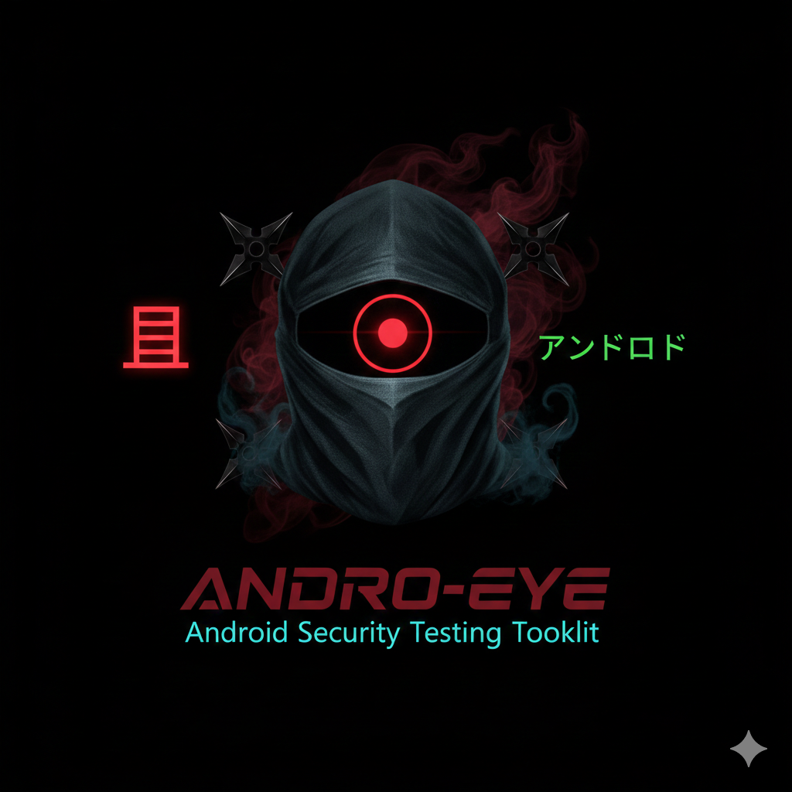

 

<a href="https://github.com/Athexblackhat/ANDRO-EYE"></a> 


# ANDRO-EYE - Android Security Testing Toolkit


 <h4 align="center"><b>
  Tool for testing your Android device and HaHaHack someone Android Phone ( Don't use with wrong intentions ) 🤘🤘 
  </b></h4>
  </p>

# ⚠️ DISCLAIMER
FOR EDUCATIONAL PURPOSES ONLY - This tool is designed for security professionals, researchers, and educators to test Android devices in controlled environments. Unauthorized use against devices you don't own or don't have permission to test is illegal. The developers assume no liability and are not responsible for any misuse or damage caused by this program.

# 📋 Table of Contents
Overview
Features
Installation
Requirements
Usage
Module Documentation
Screenshots
Contributing
License
Author

# 🔍 Overview
ANDRO-EYE is a comprehensive Bash-based Android security testing toolkit that provides over 29 different functions to interact with Android devices via ADB (Android Debug Bridge). It features beautiful animations, color-coded output, and user-friendly interfaces for various Android testing and analysis tasks.

**✨ Features**
🎨 Visual Enhancements
Color-coded output - Easy-to-read colored terminal output

Loading animations - Spinners, progress bars, and visual feedback

Device information boxes - Beautifully formatted device displays

Sparkle effects - Visual transitions and success indicators

Countdown timers - For destructive operations

**🛠️ Core Functionality**
29+ modules - Comprehensive Android device interaction

Multi-device support - Handle up to 3 devices simultaneously

Error handling - Robust error checking and user feedback

Input validation - Validates all user inputs

Progress tracking - Real-time operation progress

**🔧 Technical Features**
Modular design - Each function in separate script

Consistent color scheme - Standardized across all modules

Cross-platform - Works on Linux and macOS

Self-contained - Minimal dependencies

Update checker - Automatic version verification

# 📦 Installation
Quick Install
bash
```
git clone https://github.com/Athexblackhat/ANDRO-EYE.git
cd ANDRO-EYE
sudo bash install.sh

```
Manual Installation
bash
# Install dependencies
# For Debian/Ubuntu
```
sudo apt-get install adb fastboot ruby-full
```
# For Arch
```
sudo pacman -S android-tools ruby metasploit
```
# For CentOS/RHEL
```
sudo yum install android-tools ruby
```
# Clone and setup
```
git clone https://github.com/Athexblackhat/ANDRO-EYE.git
cd ANDRO-EYE
chmod +x ANDRO-EYE.sh
mkdir .temp
```
# Optional: Add alias
echo "alias ANDRO-EYE='cd $PWD && sudo bash ANDRO-EYE.sh'" >> ~/.bash_aliases
source ~/.bash_aliases
**🔧 Requirements**
System Requirements
OS: Linux (Ubuntu/Debian, Arch, CentOS, Fedora) or macOS

Bash: Version 4.0 or higher

ADB: Android Debug Bridge

Fastboot: Fastboot tools

Ruby: For Metasploit integration (optional)

Root access: For installation

Android Device Requirements
USB Debugging enabled

Device authorized for ADB

Android 4.0+

USB drivers installed (Windows)

***🚀 Usage***
Basic Usage
bash
**Run with sudo**
sudo ./ANDRO-EYE.sh

**Or if alias installed**
sudo ANDRO-EYE
Command Line Options
bash
sudo bash ANDRO-EYE.sh [option]

Options:
  install, -i, -install    Install ANDRO-EYE and dependencies
  help, -h, --help        Show help message
Main Menu Navigation
The tool presents a numbered menu with 29 options. Simply enter the number of the desired function.

**🎯 Use Cases**
Security Research
Test device security configurations

Analyze app permissions and behaviors

Practice penetration testing techniques

Digital Forensics
Extract device information

Capture screenshots and recordings

Copy user data for analysis

Development & Testing
Test apps on multiple devices

Debug with logcat viewer

Install/uninstall apps remotely

Education
Learn Android internals

Understand ADB commands

Practice ethical hacking


Free for educational use

Not for commercial purposes

No warranty provided

Author not liable for misuse

👤 Author
           *ATHEX BLACK HAT*

Instagram: @itx_athex86

GitHub: @Athexblackhat

Telegram: @athex_community


**📚 Additional Resources**
ADB Documentation

Metasploit Unleashed

Android Security Overview

## Remember: With great power comes great responsibility. Use this tool ethically! 🔒
